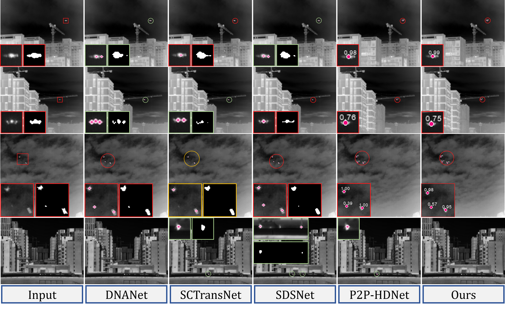

# SPIRE

Official PyTorch implementation of **SPIRE: Single-Point Supervision guided Infrared Probabilistic Response Encoding for Infrared Small Target Detection**.

## Overview
Infrared small target detection (IRSTD) is commonly formulated as a pixel-wise segmentation problem with heavy encoder-decoder architectures. However, infrared targets often occupy only a few pixels, have ambiguous boundaries, and are more naturally associated with localization rather than dense contour reconstruction.

SPIRE reformulates IRSTD as a **centroid-oriented probabilistic regression** task. Given only single-point annotations, SPIRE uses **Point-Response Prior Supervision (PRPS)** to convert sparse labels into probabilistic response maps consistent with infrared point-target characteristics, and then employs a lightweight **High-Resolution Probabilistic Encoder (HRPE)** to regress the response map directly. Final detections are obtained by peak extraction on the predicted heatmap.

Compared with conventional segmentation-based pipelines, SPIRE offers:
- single-point supervision with substantially reduced annotation cost
- an encoder-only design without a heavy decoder
- direct target-level localization with a simple inference pipeline
- competitive accuracy with low false alarm rate and low computational cost


## Paper Summary

According to the abstract and Table 1 in the paper, SPIRE achieves a strong accuracy-efficiency trade-off on both `SIRST-UAVB` and `SIRST4`, with particularly strong performance on `SIRST4`.



| Method | SIRST-UAVB Pre / Rec / F1 / Fa | SIRST4 Pre / Rec / F1 / Fa | FLOPs(G) | Params(M) |
| --- | --- | --- | --- | --- |
| SPIRE (Ours) | 99.82 / 94.44 / 97.05 / 1.02 | 95.00 / 94.21 / 94.60 / 28.53 | 7.68 | 0.29 |

Key takeaways:
- On `SIRST4`, SPIRE achieves the best `Precision`, `Recall`, `F1`, and `Fa` among the compared methods in Table 1.
- On `SIRST-UAVB`, SPIRE achieves the best `Precision` and the lowest `False Alarm`.
- SPIRE remains highly lightweight, with only `0.29M` parameters.

## Repository Structure
```text
SPIRE/
├── model/                  # SPIRENet definition
├── modules/                # network building blocks
├── utils/                  # data, training, evaluation, logging, plotting
├── tools/                  # standalone evaluation scripts
├── train.py                # single-GPU training
├── train_ddp.py            # multi-GPU DDP training
├── evaluate.py             # full evaluation / JSON-only evaluation
├── train_results/          # training outputs
└── eva_results/            # evaluation outputs
```

## Environment
Recommended environment:
- Python 3.9+
- PyTorch 2.x
- CUDA 11.8+

Main dependencies:
- `torch`
- `torchvision`
- `tensorboard`
- `numpy`
- `opencv-python`
- `Pillow`
- `matplotlib`
- `pycocotools`

Example installation:
```bash
pip install torch torchvision tensorboard numpy opencv-python pillow matplotlib pycocotools
```

## Dataset Preparation
The code currently supports two dataset layouts. The recommended unified layout is:

```text
DATA_ROOT/
├── images/
├── annotations/
│   └── annotations.json
└── img_idx/
    ├── train.txt
    └── test.txt
```

In this format:
- `images/` stores all images
- `annotations/annotations.json` is a COCO-style keypoint annotation file
- `img_idx/train.txt` and `img_idx/test.txt` define the train/test split

Example:
```bash
/root/autodl-tmp/Datasets/SIRST4
```

## Training
Training outputs are saved to:
```text
train_results/<timestamp>_<method>_<inputsize>_<dataset>_<lr>_<batchsize>_<single|ddp>
```

For example:
```text
train_results/20260402_120254_SPIRENet_512_SIRST4_0.005_2_ddp
```

Each training directory typically contains:
- `val_result.txt`: initialization information and per-epoch evaluation results
- `tensorboard_logs/`
- `plot_curve/`
- `last_epoch*.pth`
- `f1_best_epoch*.pth`
- `rec_best_epoch*.pth`
- `pre_best_epoch*.pth`

### 1. Single-GPU Training
```bash
python train.py \
  --data_path "/root/autodl-tmp/Datasets/SIRST4" \
  --fixed_size 512 512 \
  --batchSize 16 \
  --nEpochs 1000 \
  --lr 0.005 \
  --eval_interval 1 \
  --threads 4
```

Common arguments:
- `--data_path`: dataset root directory
- `--fixed_size H W`: input resolution
- `--batchSize`: batch size for single-GPU training
- `--nEpochs`: number of training epochs
- `--lr`: initial learning rate
- `--eval_interval`: evaluation interval in epochs
- `--threads`: number of DataLoader workers
- `--resume`: resume from an existing checkpoint
- `--amp`: enable mixed precision training
- `--method_name`: method name used in the result directory

Notes:
- `train.py` performs **full test-set evaluation** at each evaluation step.
- Checkpoints are maintained in four slots: `F1`, `Recall`, `Precision`, and `Last`.

### 2. Multi-GPU DDP Training
```bash
python train_ddp.py \
  --world_size 2 \
  --data_path "/root/autodl-tmp/Datasets/SIRST4" \
  --fixed_size 512 512 \
  --batchSize 2 \
  --nEpochs 1000 \
  --lr 0.005 \
  --eval_interval 1
```

Notes:
- `--batchSize` denotes the **per-GPU batch size**
- `--world_size` specifies the number of GPUs
- the main process is responsible for logging, checkpoint saving, and curve plotting
- evaluation is also conducted on the **full test set**

If you prefer `torchrun`, you may use:
```bash
torchrun --nproc_per_node=2 train_ddp.py \
  --data_path "/root/autodl-tmp/Datasets/SIRST4" \
  --fixed_size 512 512 \
  --batchSize 2 \
  --nEpochs 1000 \
  --lr 0.005 \
  --eval_interval 1
```

## Evaluation
Evaluation outputs are saved to:
```text
eva_results/<same_subdir_name_as_training_or_weight_parent>
```

If the weight parent directory already has a timestamp prefix, the evaluation directory keeps the same name. Otherwise, a timestamp prefix is added automatically.

Evaluation utilities:
- `evaluate.py`: full-model evaluation, or JSON-only evaluation through `tools/eval_from_json.py`
- `tools/eval_from_json.py`: direct evaluation for COCO-style keypoint prediction JSON files
- `tools/eval_from_mask.py`: fast target-level evaluation for mask or heatmap outputs from other encoder-decoder methods

### 1. Full Evaluation
```bash
python evaluate.py \
  --weights_path "/root/autodl-tmp/SPIRE/train_results/20260402_120254_SPIRENet_512_SIRST4_0.005_2_ddp/f1_best_epoch3.pth" \
  --data_path "/root/autodl-tmp/Datasets/SIRST4" \
  --fixed_size 512 512
```

Default behavior:
- run inference on the full test set
- save `val_result.txt`
- save `predictions_coco.json`
- report inference time statistics

Common arguments:
- `--weights_path`: path to the checkpoint to evaluate
- `--data_path`: dataset root directory
- `--fixed_size H W`: input resolution for evaluation, which should match training
- `--threshold`: peak detection threshold
- `--value_range`: local peak suppression range
- `--max_num_targets`: maximum number of targets per image
- `--tp_distance`: TP distance threshold
- `--save_json`: whether to save `predictions_coco.json`
- `--single_predict / --contrast_predict / --save_heatmap`: whether to export visualization results

### 2. JSON-only Evaluation
If `predictions_coco.json` is already available, you can directly re-evaluate it:
```bash
python evaluate.py \
  --weights_path "/root/autodl-tmp/SPIRE/20260130_LiTENet_SIRST4_16_512_0.005_1000/model-230.pth" \
  --data_path "/root/autodl-tmp/Datasets/SIRST4" \
  --json_eval \
  --pred_json "/root/autodl-tmp/SPIRE/eva_results/20260130_LiTENet_SIRST4_16_512_0.005_1000/predictions_coco.json"
```

This mode directly calls `tools/eval_from_json.py` inside `evaluate.py` and additionally produces:
- a multi-threshold `PD / FA / F1` table
- `json_eval_report.txt`

### 3. Standalone Evaluation Tools
#### `tools/eval_from_json.py`
Use this script to evaluate COCO-style keypoint JSON files directly.

```bash
python tools/eval_from_json.py \
  --gt "/path/to/annotations.json" \
  --pred "/path/to/predictions_coco.json" \
  --tp-distance 5 \
  --thresholds 0.1 0.3 0.5 0.7 0.9 \
  --output "/path/to/json_eval_report.txt"
```

Notes:
- `--gt` and `--pred` must both be COCO-style keypoint JSON files.
- Image size is read from the JSON `images` field and is used for `FA`.
- Evaluation is performed on image IDs appearing in the prediction JSON.

You can also invoke the same logic through `evaluate.py`:

```bash
python evaluate.py \
  --weights_path "/path/to/weights.pth" \
  --data_path "/path/to/dataset" \
  --json_eval \
  --pred_json "/path/to/predictions_coco.json" \
  --pdfa_thresholds 0.1 0.3 0.5 0.7 0.9
```

In this mode, `evaluate.py` resolves the GT JSON from `--data_path` (or `--gt_json_path` if provided), loads `tools/eval_from_json.py`, and writes `json_eval_report.txt`.

#### `tools/eval_from_mask.py`
`tools/eval_from_mask.py` is designed for quick benchmarking of other encoder-decoder methods. It converts predicted masks or heatmaps into target points by 8-connected component extraction, then evaluates them with the same target-level metrics used by `tools/eval_from_json.py`.

```bash
python tools/eval_from_mask.py \
  --gt-masks "/path/to/gt_masks" \
  --pred-masks "/path/to/pred_masks" \
  --images "/path/to/images" \
  --tp-distance 5 \
  --thresholds 0.1 0.3 0.5 0.7 0.9 \
  --output "/path/to/mask_eval_report.txt"
```

Notes:
- `--pred-masks` defines the evaluated image set.
- Input predictions may be binary masks or heatmaps in either `0-1` or `0-255` range.
- Targets are extracted by 8-connected component clustering.
- The default target center is the weighted centroid; use `--no-weighted-centroid` to switch to the geometric centroid.
- The confidence score of each extracted target is the maximum pixel value inside its connected region after normalization.

### 4. Metric Definition
Both scripts use the same target-level evaluation logic.

- Matching is GT-driven and one-to-one: each GT is matched to the nearest unmatched prediction within `tp_distance`, and each prediction can match at most one GT.
- `TP`: matched predictions.
- `FP`: unmatched predictions that remain after thresholding.
- `FN`: ground-truth targets not matched by any valid prediction.
- `Precision = TP / (TP + FP)`.
- `Recall = TP / (TP + FN)`.
- `F1 = 2 * Precision * Recall / (Precision + Recall)`.
- `PD = Recall`.
- `FA = FP / total_pixels`, where `total_pixels` is the sum of image areas over the evaluated set.
- The multi-threshold table is obtained by filtering predictions with `score >= threshold` and recomputing `TP / FP / FN / Precision / Recall / F1 / PD / FA` at each threshold.

## Output Convention
Training phase:
- `last_epoch*.pth`: checkpoint from the most recent evaluation step
- `f1_best_epoch*.pth`: best checkpoint by F1
- `rec_best_epoch*.pth`: best checkpoint by Recall
- `pre_best_epoch*.pth`: best checkpoint by Precision

Evaluation phase:
- `val_result.txt`: aggregate metrics and error sample IDs
- `predictions_coco.json`: COCO-style prediction file
- `json_eval_report.txt`: JSON-only evaluation report

## Remarks
- The current implementation focuses on **target-level localization evaluation**, rather than mask-based segmentation evaluation.
- Default thresholds in `train.py`, `train_ddp.py`, and `evaluate.py` are aligned.
- Output directories use a Linux/Windows-safe timestamp format: `YYYYMMDD_HHMMSS`.

## Acknowledgement
This code is heavily based on [WZMIAOMIAO's deep-learning-for-image-processing](https://github.com/WZMIAOMIAO/deep-learning-for-image-processing). Thanks for the great work.  
This code is heavily based on [Basic-IRSTD](https://github.com/XinyiYing/BasicIRSTD). Thanks Xinyi Ying.

## Citation
If you find this repository useful, please cite the SPIRE paper once the final bibliographic information is released. 

## Contact
Welcome to raise issues or email to nirixiang@nudt.edu.cn for any question.
